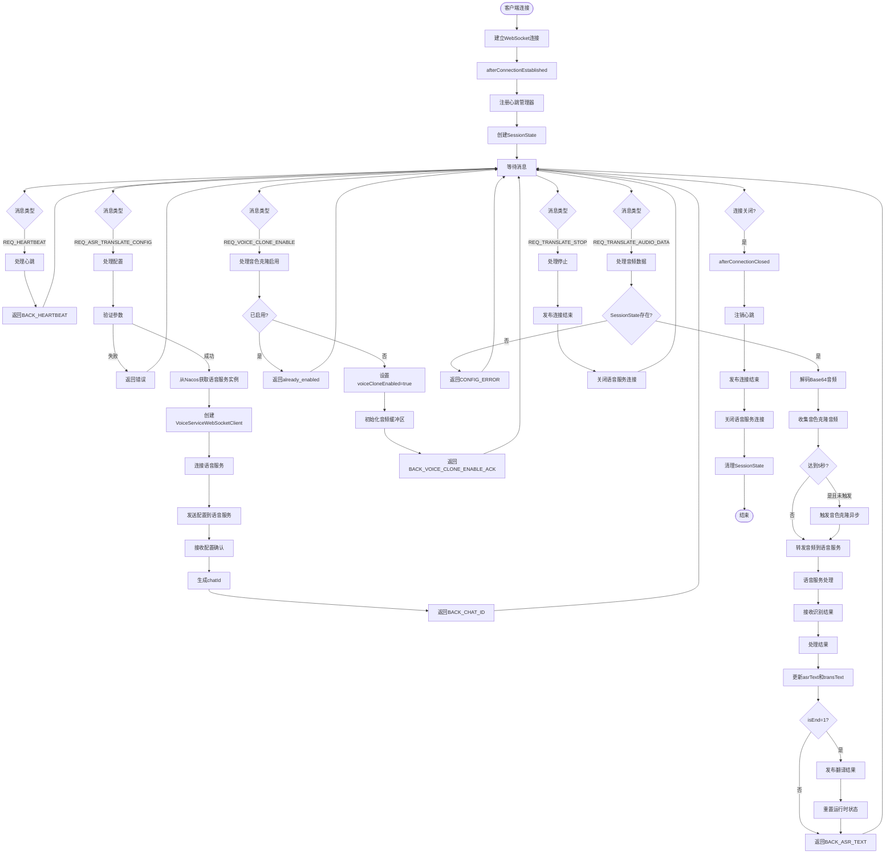
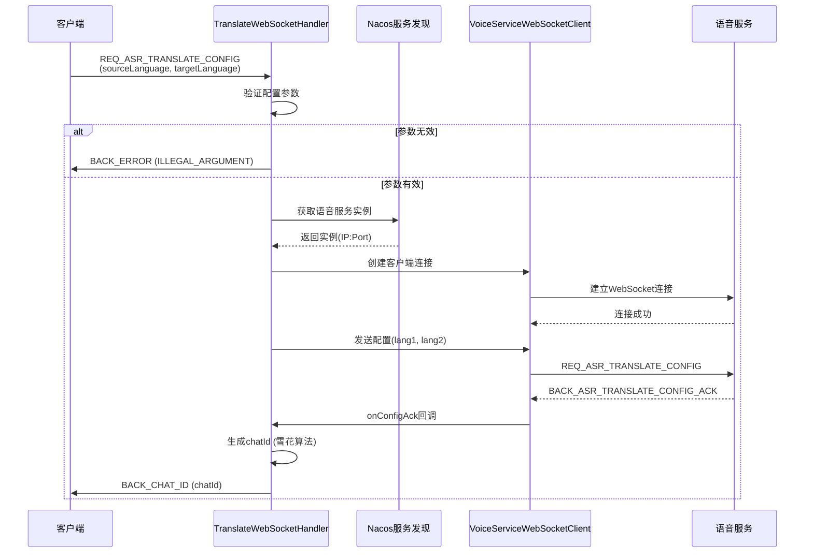
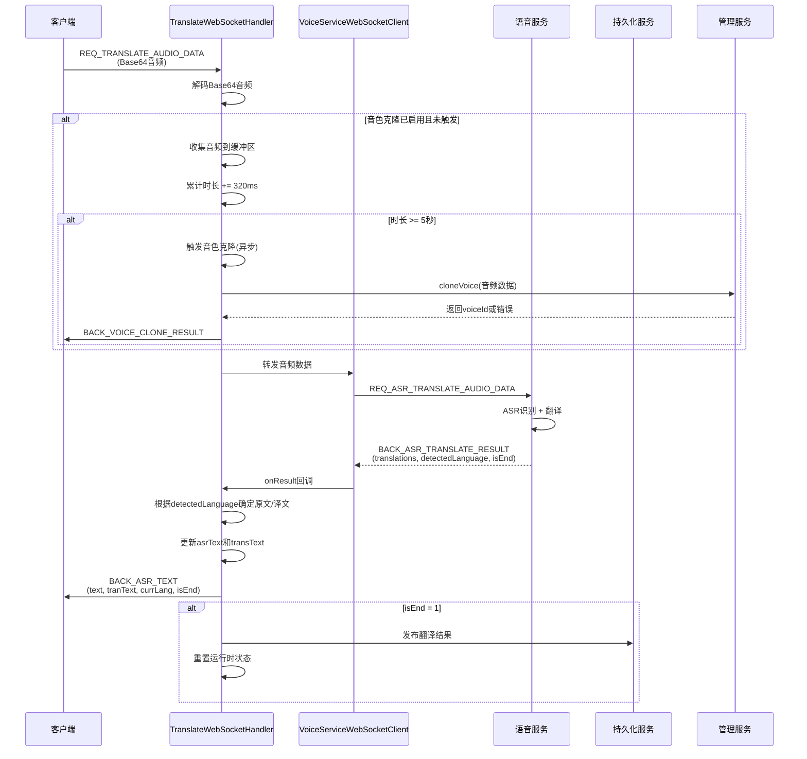
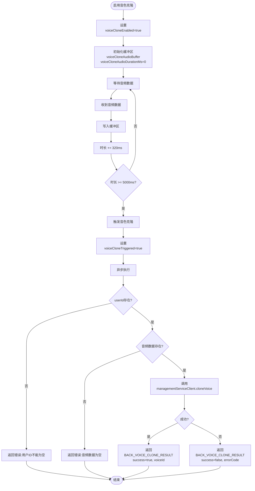
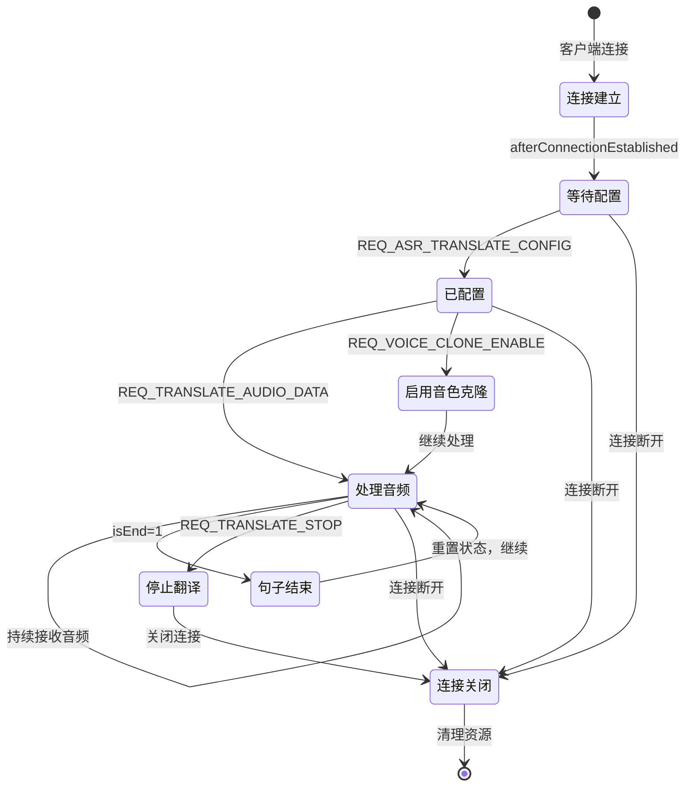
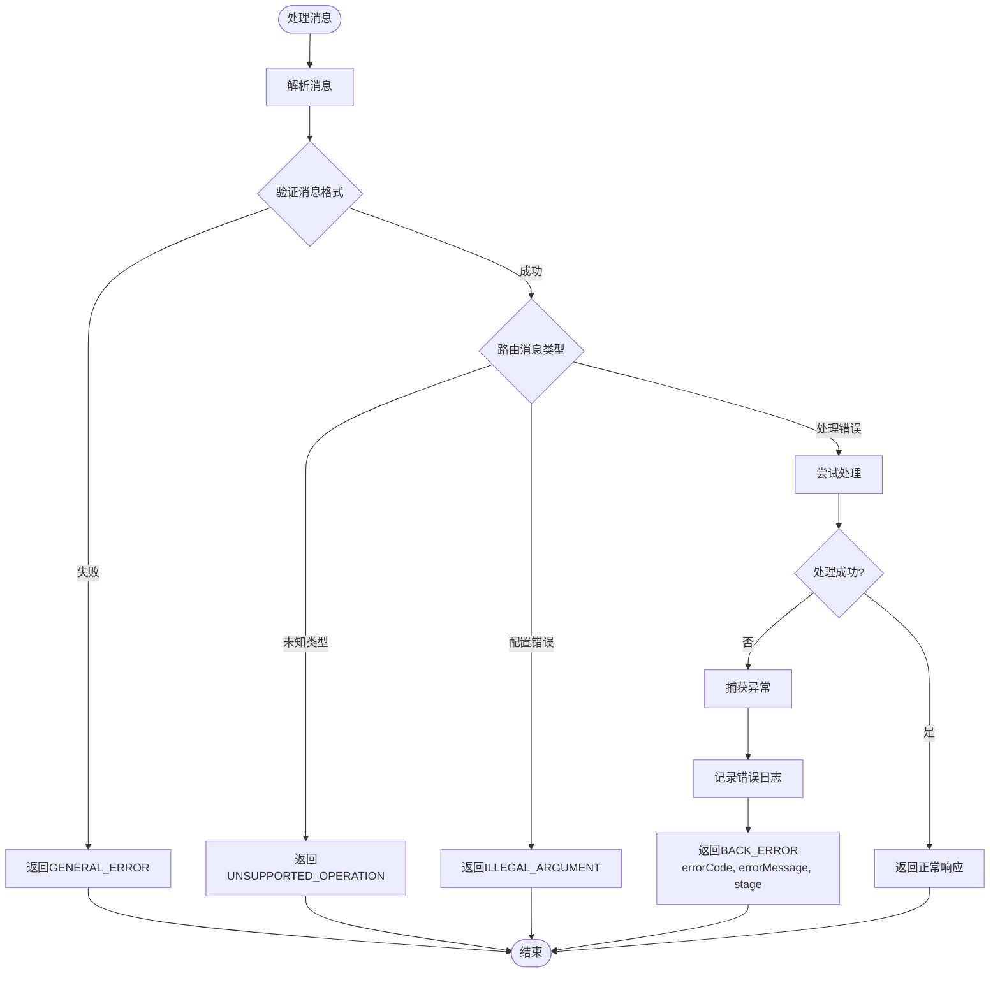
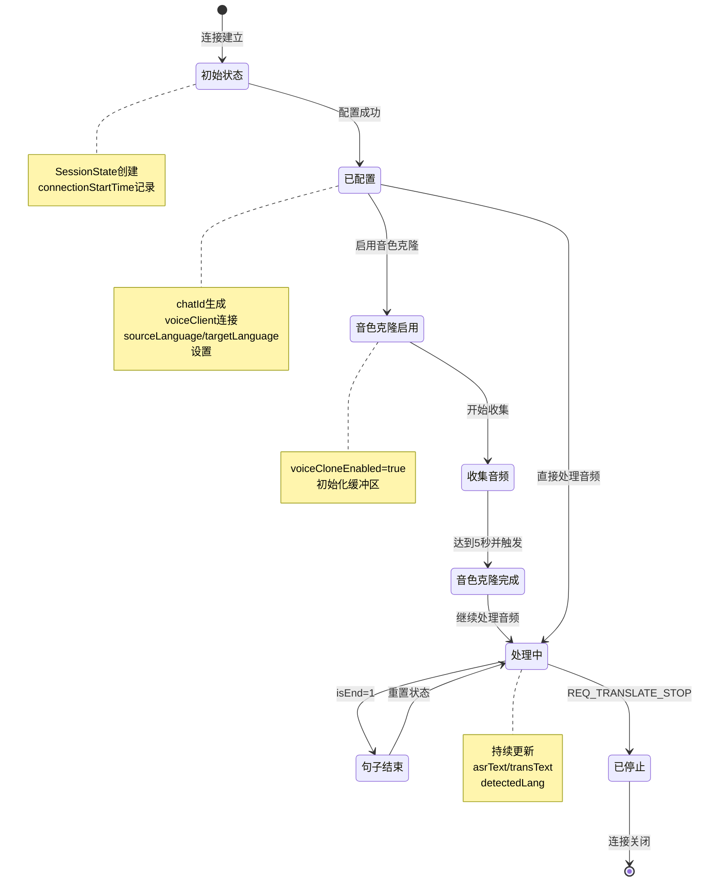

# TranslateWebSocketHandler 流程图

## 一、整体流程图

```mermaid
graph TB
    Start([客户端连接]) --> Connect[建立WebSocket连接]
    Connect --> AfterConnect[afterConnectionEstablished]
    AfterConnect --> Register[注册心跳管理器]
    Register --> CreateState[创建SessionState]
    CreateState --> WaitMsg[等待消息]
    
    WaitMsg --> Heartbeat{消息类型}
    WaitMsg --> Config{消息类型}
    WaitMsg --> VoiceClone{消息类型}
    WaitMsg --> AudioData{消息类型}
    WaitMsg --> Stop{消息类型}
    
    Heartbeat -->|REQ_HEARTBEAT| HandleHB[处理心跳]
    HandleHB --> ReturnHB[返回BACK_HEARTBEAT]
    ReturnHB --> WaitMsg
    
    Config -->|REQ_ASR_TRANSLATE_CONFIG| HandleConfig[处理配置]
    HandleConfig --> Validate[验证参数]
    Validate -->|失败| Error1[返回错误]
    Validate -->|成功| GetNacos[从Nacos获取语音服务实例]
    GetNacos --> CreateVoiceClient[创建VoiceServiceWebSocketClient]
    CreateVoiceClient --> ConnectVoice[连接语音服务]
    ConnectVoice --> SendConfig[发送配置到语音服务]
    SendConfig --> ReceiveAck[接收配置确认]
    ReceiveAck --> GenChatId[生成chatId]
    GenChatId --> ReturnChatId[返回BACK_CHAT_ID]
    ReturnChatId --> WaitMsg
    
    VoiceClone -->|REQ_VOICE_CLONE_ENABLE| HandleVC[处理音色克隆启用]
    HandleVC --> CheckVC{已启用?}
    CheckVC -->|是| ReturnVCAlready[返回already_enabled]
    CheckVC -->|否| EnableVC[设置voiceCloneEnabled=true]
    EnableVC --> InitVC[初始化音频缓冲区]
    InitVC --> ReturnVC[返回BACK_VOICE_CLONE_ENABLE_ACK]
    ReturnVC --> WaitMsg
    ReturnVCAlready --> WaitMsg
    
    AudioData -->|REQ_TRANSLATE_AUDIO_DATA| HandleAudio[处理音频数据]
    HandleAudio --> CheckState{SessionState存在?}
    CheckState -->|否| Error2[返回CONFIG_ERROR]
    CheckState -->|是| DecodeAudio[解码Base64音频]
    DecodeAudio --> CollectVC[收集音色克隆音频]
    CollectVC --> CheckVCDuration{达到5秒?}
    CheckVCDuration -->|是且未触发| TriggerVC[触发音色克隆异步]
    CheckVCDuration -->|否| ForwardAudio[转发音频到语音服务]
    TriggerVC --> ForwardAudio
    ForwardAudio --> VoiceProcess[语音服务处理]
    VoiceProcess --> ReceiveResult[接收识别结果]
    ReceiveResult --> ProcessResult[处理结果]
    ProcessResult --> UpdateText[更新asrText和transText]
    UpdateText --> CheckEnd{isEnd=1?}
    CheckEnd -->|是| PublishResult[发布翻译结果]
    CheckEnd -->|否| ReturnASR[返回BACK_ASR_TEXT]
    PublishResult --> ResetState[重置运行时状态]
    ResetState --> ReturnASR
    ReturnASR --> WaitMsg
    
    Stop -->|REQ_TRANSLATE_STOP| HandleStop[处理停止]
    HandleStop --> PublishEnd[发布连接结束]
    PublishEnd --> CloseVoice[关闭语音服务连接]
    CloseVoice --> WaitMsg
    
    WaitMsg --> Close{连接关闭?}
    Close -->|是| AfterClose[afterConnectionClosed]
    AfterClose --> Unregister[注销心跳]
    Unregister --> PublishEnd2[发布连接结束]
    PublishEnd2 --> CloseVoice2[关闭语音服务连接]
    CloseVoice2 --> CleanState[清理SessionState]
    CleanState --> End([结束])
    
    Error1 --> WaitMsg
    Error2 --> WaitMsg
```

## 二、配置阶段详细流程

```mermaid
sequenceDiagram
    participant Client as 客户端
    participant Handler as TranslateWebSocketHandler
    participant Nacos as Nacos服务发现
    participant VoiceClient as VoiceServiceWebSocketClient
    participant VoiceService as 语音服务
    
    Client->>Handler: REQ_ASR_TRANSLATE_CONFIG<br/>(sourceLanguage, targetLanguage)
    Handler->>Handler: 验证配置参数
    alt 参数无效
        Handler->>Client: BACK_ERROR (ILLEGAL_ARGUMENT)
    else 参数有效
        Handler->>Nacos: 获取语音服务实例
        Nacos-->>Handler: 返回实例(IP:Port)
        Handler->>VoiceClient: 创建客户端连接
        VoiceClient->>VoiceService: 建立WebSocket连接
        VoiceService-->>VoiceClient: 连接成功
        Handler->>VoiceClient: 发送配置(lang1, lang2)
        VoiceClient->>VoiceService: REQ_ASR_TRANSLATE_CONFIG
        VoiceService-->>VoiceClient: BACK_ASR_TRANSLATE_CONFIG_ACK
        VoiceClient->>Handler: onConfigAck回调
        Handler->>Handler: 生成chatId (雪花算法)
        Handler->>Client: BACK_CHAT_ID (chatId)
    end
```

## 三、音频处理详细流程

```mermaid
sequenceDiagram
    participant Client as 客户端
    participant Handler as TranslateWebSocketHandler
    participant VoiceClient as VoiceServiceWebSocketClient
    participant VoiceService as 语音服务
    participant Persist as 持久化服务
    participant Mgmt as 管理服务
    
    Client->>Handler: REQ_TRANSLATE_AUDIO_DATA<br/>(Base64音频)
    Handler->>Handler: 解码Base64音频
    
    alt 音色克隆已启用且未触发
        Handler->>Handler: 收集音频到缓冲区
        Handler->>Handler: 累计时长 += 320ms
        alt 时长 >= 5秒
            Handler->>Handler: 触发音色克隆(异步)
            Handler->>Mgmt: cloneVoice(音频数据)
            Mgmt-->>Handler: 返回voiceId或错误
            Handler->>Client: BACK_VOICE_CLONE_RESULT
        end
    end
    
    Handler->>VoiceClient: 转发音频数据
    VoiceClient->>VoiceService: REQ_ASR_TRANSLATE_AUDIO_DATA
    VoiceService->>VoiceService: ASR识别 + 翻译
    VoiceService-->>VoiceClient: BACK_ASR_TRANSLATE_RESULT<br/>(translations, detectedLanguage, isEnd)
    VoiceClient->>Handler: onResult回调
    Handler->>Handler: 根据detectedLanguage确定原文/译文
    Handler->>Handler: 更新asrText和transText
    Handler->>Client: BACK_ASR_TEXT<br/>(text, tranText, currLang, isEnd)
    
    alt isEnd = 1
        Handler->>Persist: 发布翻译结果
        Handler->>Handler: 重置运行时状态
    end
```

## 四、音色克隆流程

```mermaid
flowchart TD
    Start([启用音色克隆]) --> Enable[设置voiceCloneEnabled=true]
    Enable --> Init[初始化缓冲区<br/>voiceCloneAudioBuffer<br/>voiceCloneAudioDurationMs=0]
    Init --> Wait[等待音频数据]
    
    Wait --> Receive[收到音频数据]
    Receive --> Collect[写入缓冲区]
    Collect --> Add[时长 += 320ms]
    Add --> Check{时长 >= 5000ms?}
    
    Check -->|否| Wait
    Check -->|是| Trigger[触发音色克隆]
    Trigger --> SetFlag[设置voiceCloneTriggered=true]
    SetFlag --> Async[异步执行]
    
    Async --> CheckUserId{userId存在?}
    CheckUserId -->|否| Error1[返回错误:用户ID不能为空]
    CheckUserId -->|是| CheckAudio{音频数据存在?}
    CheckAudio -->|否| Error2[返回错误:音频数据为空]
    CheckAudio -->|是| CallAPI[调用managementServiceClient.cloneVoice]
    
    CallAPI --> Success{成功?}
    Success -->|是| ReturnSuccess[返回BACK_VOICE_CLONE_RESULT<br/>success=true, voiceId]
    Success -->|否| ReturnError[返回BACK_VOICE_CLONE_RESULT<br/>success=false, errorCode]
    
    Error1 --> End([结束])
    Error2 --> End
    ReturnSuccess --> End
    ReturnError --> End
```

## 五、连接生命周期

```mermaid
stateDiagram-v2
    [*] --> 连接建立: 客户端连接
    连接建立 --> 等待配置: afterConnectionEstablished
    等待配置 --> 已配置: REQ_ASR_TRANSLATE_CONFIG
    已配置 --> 处理音频: REQ_TRANSLATE_AUDIO_DATA
    处理音频 --> 处理音频: 持续接收音频
    处理音频 --> 句子结束: isEnd=1
    句子结束 --> 处理音频: 重置状态，继续
    已配置 --> 启用音色克隆: REQ_VOICE_CLONE_ENABLE
    启用音色克隆 --> 处理音频: 继续处理
    处理音频 --> 停止翻译: REQ_TRANSLATE_STOP
    停止翻译 --> 连接关闭: 关闭连接
    等待配置 --> 连接关闭: 连接断开
    已配置 --> 连接关闭: 连接断开
    处理音频 --> 连接关闭: 连接断开
    连接关闭 --> [*]: 清理资源
```

## 六、错误处理流程

```mermaid
flowchart TD
    Start([处理消息]) --> Parse[解析消息]
    Parse --> Validate{验证消息格式}
    Validate -->|失败| Error1[返回GENERAL_ERROR]
    Validate -->|成功| Route{路由消息类型}
    
    Route -->|未知类型| Error2[返回UNSUPPORTED_OPERATION]
    Route -->|配置错误| Error3[返回ILLEGAL_ARGUMENT]
    Route -->|处理错误| Try[尝试处理]
    
    Try --> Success{处理成功?}
    Success -->|是| Return[返回正常响应]
    Success -->|否| Catch[捕获异常]
    
    Catch --> Log[记录错误日志]
    Log --> Error4[返回BACK_ERROR<br/>errorCode, errorMessage, stage]
    
    Error1 --> End([结束])
    Error2 --> End
    Error3 --> End
    Error4 --> End
    Return --> End
```

## 七、状态转换图

```mermaid
stateDiagram-v2
    [*] --> 初始状态: 连接建立
    
    初始状态 --> 已配置: 配置成功
    已配置 --> 音色克隆启用: 启用音色克隆
    音色克隆启用 --> 收集音频: 开始收集
    收集音频 --> 音色克隆完成: 达到5秒并触发
    音色克隆完成 --> 处理中: 继续处理音频
    
    已配置 --> 处理中: 直接处理音频
    处理中 --> 句子结束: isEnd=1
    句子结束 --> 处理中: 重置状态
    
    处理中 --> 已停止: REQ_TRANSLATE_STOP
    已停止 --> [*]: 连接关闭
    
    note right of 初始状态
        SessionState创建
        connectionStartTime记录
    end note
    
    note right of 已配置
        chatId生成
        voiceClient连接
        sourceLanguage/targetLanguage设置
    end note
    
    note right of 音色克隆启用
        voiceCloneEnabled=true
        初始化缓冲区
    end note
    
    note right of 处理中
        持续更新
        asrText/transText
        detectedLang
    end note
```
